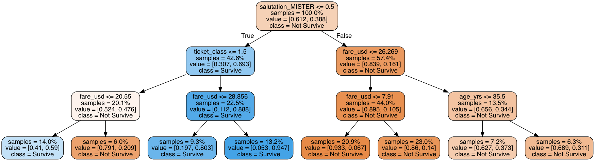

# Titanic Survival Predictions (Python)

A binary classification model, inspired by the ["Titanic" Kaggle Challenge](https://www.kaggle.com/c/titanic).

Predicts whether or not a given passenger will survive, based on characteristics such as age, gender, and how much money their ticket cost.

## [Data Dictionary](DATA.md)

## Setup

Setup virtual environment:

```sh
conda create -n titanic-env python=3.7
conda activate titanic-env
```

Install package dependencies:

```sh
pip install -r requirements.txt
```

## Usage

Import the data, generate profile reports, and train and score the classifier:

```sh
python -m app.importer
python -m app.profiler
python -m app.classifier
```

## Results

Current Validation Accuracy: 82% - 83%

Decision Tree Logic:


